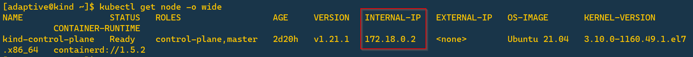
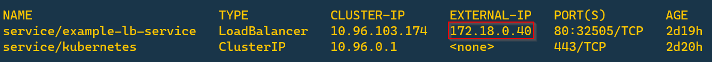
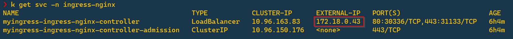
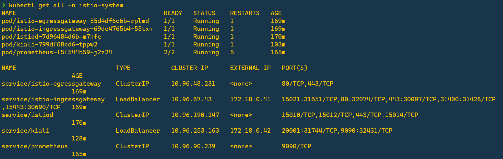
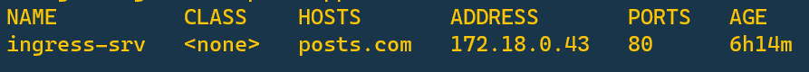
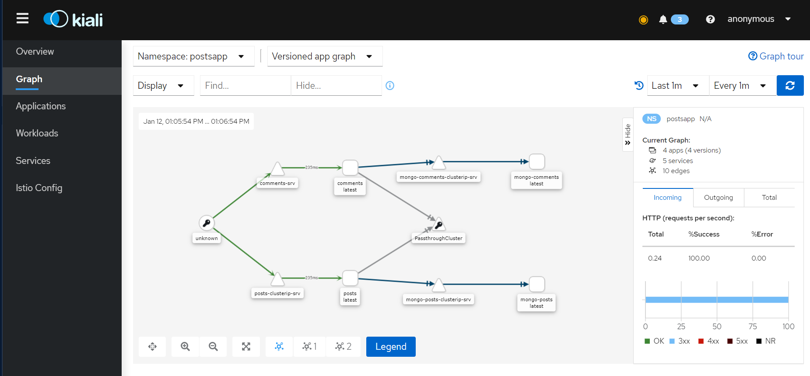

# QuickStart; Microservice Research
## Install and Configure Kubernetes Cluster
you can use Kind, Minikube, or k3s. but here we can use Kind as kubernetes environment

### Kind Kubernetes Cluster Documentation
<br>
<p align="center"></p>

[`https://github.com/launathiel/kubernetes-lightweight/blob/main/kind/kind.md`](https://github.com/launathiel/kubernetes-lightweight/blob/main/kind/kind.md)

---
## Deploy MetalLB
source: `https://metallb.universe.tf/installation/`
```bash
kubectl edit configmap -n kube-system kube-proxy
```
and set
```bash
apiVersion: kubeproxy.config.k8s.io/v1alpha1
kind: KubeProxyConfiguration
mode: "ipvs"
ipvs:
  strictARP: true #if false, set to true
```
### Install By Manifest
```bash
kubectl apply -f https://raw.githubusercontent.com/metallb/metallb/v0.11.0/manifests/namespace.yaml
kubectl apply -f https://raw.githubusercontent.com/metallb/metallb/v0.11.0/manifests/metallb.yaml
```
### Add MetalLB Configuration
```bash
apiVersion: v1
kind: ConfigMap
metadata:
  namespace: metallb-system
  name: config
data:
  config: |
    address-pools:
    - name: default
      protocol: layer2
      addresses:
      - 172.18.0.40-172.18.0.50
```
you can check addresses from any range on your kubernetes node IP network

for example, 
```bash
kubectl get node -o wide
``` 


Here, you get `172.18.0.2`. so you can use `172.18.0.40-172.18.0.50` as addresses range

### For Testing,
```bash 
kubectl apply -f https://raw.githubusercontent.com/adaptivenetlab/Kubernetes/main/template/deployment/deployment.yaml
kubectl apply -f https://raw.githubusercontent.com/adaptivenetlab/Kubernetes/main/template/service/loadbalancer.yaml
kubectl get svc 
```

>if you get external IP and you can access the service, it means that your metallb loadbalancer has sucessfully deployed!

#### Delete Testing
```bash 
kubectl delete -f https://raw.githubusercontent.com/adaptivenetlab/Kubernetes/main/template/deployment/deployment.yaml
kubectl delete -f https://raw.githubusercontent.com/adaptivenetlab/Kubernetes/main/template/service/loadbalancer.yaml
```
---
## Ingress Nginx 
### You need helm installed on your host
```bash
curl -fsSL -o get_helm.sh https://raw.githubusercontent.com/helm/helm/main/scripts/get-helm-3
chmod 700 get_helm.sh
./get_helm.sh
```
### Deploy Ingress Nginx Using Helm Chart 
```
helm repo add ingress-nginx https://kubernetes.github.io/ingress-nginx
kubectl create ns ingress-nginx
helm install myingress ingress-nginx/ingress-nginx -n ingress-nginx
helm list -n ingress-nginx
kubectl get all -n igress-nginx
```
#### Check Ingress IP address

> note that External-IP
---
## Install Istio

### Download Istio file
```bash
curl -L https://istio.io/downloadIstio | sh -
cd istio-1.9.2
export PATH=$PWD/bin:$PATH
```
### Install the Istio Operator
```bash
istioctl operator init  
kubectl get all -n istio-operator
```
### Apply istio
```bash
kubectl create ns istio-system
kubectl apply -f - <<EOF
apiVersion: install.istio.io/v1alpha1
kind: IstioOperator
metadata:
  namespace: istio-system
  name: example-istiocontrolplane
spec:
  profile: demo
EOF
```
### Check if Istio has sucessfully installed
```bash
kubectl get all -n istio-system
```


---
## Namespace Label for Service Mesh
### Create postsapp Namespace
```bash
kubectl create ns postsapp
```
### Create istio injection label
```bash
kubectl label ns postsapp istio-injection=enabled
```
---
## Microservice Deployment
### MongoDB
```bash
kubectl apply -f MongoDB/mongodb-secrets.yaml -n postsapp
```
#### Mongo Posts
```bash
kubectl apply -f MongoDB/MongoDB-posts/mongodb-pv.yaml -n postsapp
kubectl apply -f MongoDB/MongoDB-posts/mongodb-pvc.yaml -n postsapp
kubectl apply -f MongoDB/MongoDB-posts/mongodb-deployment.yaml -n postsapp
kubectl apply -f MongoDB/MongoDB-posts/mongodb-clusterip.yaml -n postsapp
```
#### Mongo Comments
```bash
kubectl apply -f MongoDB/MongoDB-comments/mongodb-pv.yaml -n postsapp
kubectl apply -f MongoDB/MongoDB-comments/mongodb-pvc.yaml -n postsapp
kubectl apply -f MongoDB/MongoDB-comments/mongodb-deployment.yaml -n postsapp
kubectl apply -f MongoDB/MongoDB-comments/mongodb-clusterip.yaml -n postsapp
```
### Microservices
```bash 
kubectl apply -f infra/k8s/posts-depl.yaml -n postsapp
kubectl apply -f infra/k8s/comments-depl.yaml -n postsapp
kubectl apply -f infra/k8s/client-depl.yaml -n postsapp
```
---
## Configure Ingress Rule
```bash
kubectl apply -f ingress-srv.yaml -n postsapp
```


### Add Ingress IP to /etc/hosts On VM
`sudo vi /etc/hosts`
```bash
172.18.0.43 posts.com
```
---
## Access from Tunnel Proxy
`ssh -ND 9090 user@192.168.0.20`
using `socks5://127.0.0.1:9090`

### Access From Browser
```bash
chrome.exe --proxy-server="socks5://localhost:9090"
```
and check on chrome, `posts.com/posts`
---
## Istio Monitoring
### Install Prometheus
```bash
kubectl apply -f https://gitlab.com/gilangvperdana/microservices-app-on-k-8-s-with-istio/-/raw/master/addons/prometheus.yaml -n istio-system
```

### Install Grafana (Optional)
```bash
kubectl apply -f https://gitlab.com/gilangvperdana/microservices-app-on-k-8-s-with-istio/-/raw/master/addons/grafana.yaml -n istio-system
```

Change Service Grafana to LoadBalancer:
```bash
kubectl edit svc grafana -n istio-system
```
access `http://<ip-external-service-grafana>:3000`

### Install Kiali
```bash
kubectl apply -f https://gitlab.com/adaptivenetlab/adaptive-network-laboratory-kubernetes-service-mesh-untuk-aplikasi-microservices/-/raw/master/addons/kiali-crd.yaml -n istio-system

kubectl apply -f https://gitlab.com/adaptivenetlab/adaptive-network-laboratory-kubernetes-service-mesh-untuk-aplikasi-microservices/-/raw/master/addons/kiali.yaml -n istio-system
```

Change service to LoadBalancer:
```bash
kubectl edit svc kiali -n istio-system
kubectl get svc kiali -n istio-system
```
access `http://ip_external_kiali:20001`



## Client Application


>Happy Exploring!

<br>

# Using and Explore Istio Feature
for detail, click [here](infra/istio/istio-feature.md)
```bash
kubectl apply -f infra/istio/gateway.yaml
kubectl apply -f infra/istio/destination-rule.yaml
kubectl apply -f infra/istio/virtual-service.yaml
```